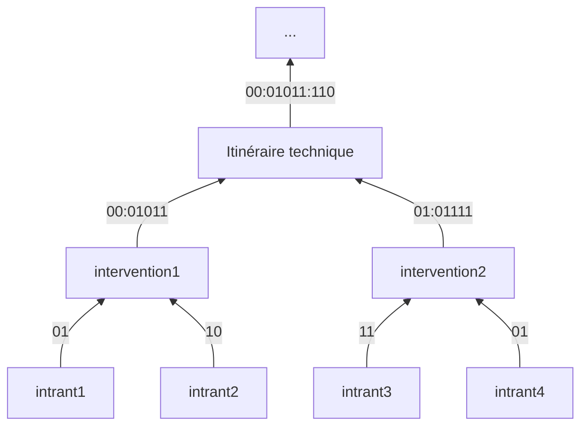

## Nettoyage avec des fonctions de tests

### Contexte
La base de données étant polluée  par de nombreuses erreurs de saisies, on se propose de discréditer les entités porteuses d'informations parasitées.

### Mise en place
Les scripts présents dans le répertoire [scripts/nettoyage_global/fonctions_tests](../../scripts/nettoyage_global/fonctions_tests/) permettent de réaliser ces tests de conformités. Ils attribuent à chaque entité une note de conformité, consistant en un vecteur binaire indiquant les tests réalisés et les tests ratés. La description de ces tests ainsi que leur position dans le vecteur binaire sont donnés dans le fichier [data/metadonnees_tests.csv](../../data/metadonnees_tests.csv). La description des seuils utilisés pour ces tests est disponible dans le fichier [data/metadonnees_seuils.csv](../../data/metadonnees_seuils.csv).

Certains des tests utilisent aussi des fonctions utiles, déclarées dans le fichier [scripts/utils/fonctions_utiles](../../scripts/utils/fonctions_utiles.py).

### Exemple

Le diagramme ci-dessous transcrit un exemple d'obtention de note de nettoyage sur un exemple symple d'itinéraire technique avec deux interventions et deux utilisations d'intrants par interventions.

> À chaque étape d'aggrégation, on remonte le flux de données en effectuant le minimum sur tous les digits.
> 
> Par exemple, les deux premiers digits remontés par **intervention2** sont porteurs de l'informations des intrants. Le premier digit vaut 0 car au moins l'un de ces intrants est nul. Le second vaut 1 car tous les intrants sont valides.
> 
> Le niveau d'information sur ce schéma est matérialisé par le caractère ":". Ainsi, pour l'itinéraire technique, les deux premiers digits correspondenta à la note des intrants, les 5 suivants à la note des interventions et les 3 suivants à la note propre de l'itinéraire.

### Test des fonctions

La validité de chacune des fonctions tests est testée sur un lot de données. Les tests sont réalisés grace à pytest et chacun d'eux est disponible dans le repertoire de tests. 
Plus d'informations dans le répertoire [tests/](../../tests/).