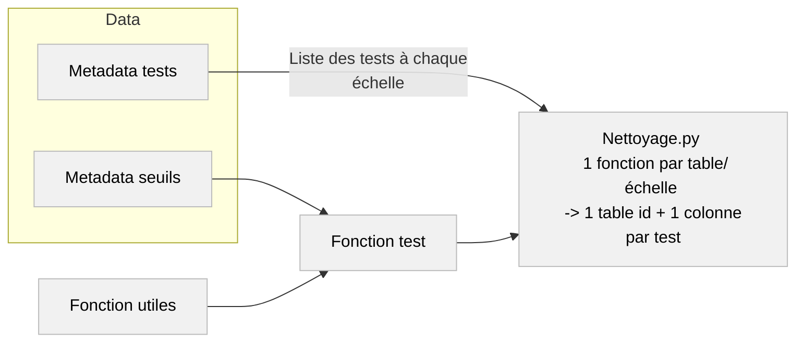
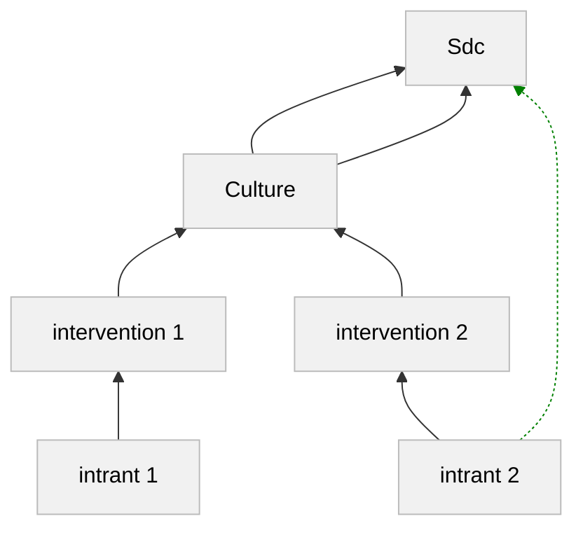

## Outils

### Contexte
Toutes les tables générés par ce repértoire permettent de manipuler efficacement l'entrepôt de données Agrosyst. Les catégories générées sont décrites ci-dessous.

### Catégories

#### Nettoyage

Nettoyage.py consiste en une fonction pour chaque echelle (utilisation_intrant_realise, intervention_realise) produisant une table avec en colonne l'id de l'entité + une colonne pour chaque test.

Pour chaque table/échelle, sont appliquées les fonctions de test de conformité présentes dans le répertoire [scripts/nettoyage_global/fonctions_tests](../../scripts/nettoyage_global/fonctions_tests/). Ces tests attribuent à chaque entité une note de conformité, consistant en un vecteur binaire indiquant les tests passés et les tests échoués (1 pour passé, 0 pour raté).

La liste et description des ces tests sont donnés dans le fichier [data/metadonnees_tests.csv](../../data/metadonnees_tests.csv).

Les fonctions tests utilisent des **seuils à dire d'experts** listés et décrits dans le fichier [data/metadonnees_seuils.csv](../../data/metadonnees_seuils.csv).

Certains des tests utilisent aussi des fonctions utiles, déclarées dans le fichier [scripts/utils/fonctions_utiles](../../scripts/utils/fonctions_utiles.py).

#### Agregation
Les tables générées par ce fichier permettent de **'sauter' efficacement d'une échelle à une autre** dans les données. Par exemple, elles permettent d'obtenir directement le domaine associé à une utilisation d'intrant sans être obligé d'effectuer toutes les fusions à la main.

#### Restructuration
Les tables de restructuration permettent essentiellement de corriger des problèmes dans les données issues du synthétisé. 

Notamment, elles permettent de proposer de travailler avec des identifiants 'id' plutôt qu'avec des 'code'. Les prétraitement consistent bien souvent à aller rechercher l'année du domaine de rattachement et à sélectionner parmis les idenfiants possibles avec le même code, celui de la bonne année.

#### Indicateurs
Les tables Indicateurs proposent des informations supplémentaires sur des indicateurs non retournés par Agrosyst. 
